# iaw-practica-13.3

En esta práctica haremos uso de **AWS SDK (boto3) de Python** para realizar acciones sobre AWS, como crear grupos de seguridad, instancias, asignar IP elástica a las instancias...

## Instalación y preparación del entorno virtual

Para empezar, **hay que preparar un entorno virtual**, que nos servirá para instalar módulos necesarios y eliminarlos al borrar el entorno virtual, en un directorio que será un repositorio que crearemos y clonaremos en nuestra máquina local. Para crear el entorno virtual, antes tendremos que realizar la actualización del gestor de paquetes PIP de Python3 e instalar el módulo del entorno virtual:

```bash
python3 -m pip install --upgrade pip && pip install virtualenv --upgrade
```

A continuación, procederemos a situarnos sobre el directorio en el que hemos clonado el repositorio y crearemos el entorno virtual mediante:

```bash
python3 -m venv .venv
```

Con este comando **debería crearse el directorio oculto .venv** en el directorio en el que hemos ejecutado el comando, procederemos a activar el entorno virtual desde el directorio en el que se encuentra el directorio oculto .venv con el comando:

```bash
. .venv/bin/activate
```

Después procederemos a instalar **boto3** y por consiguiente **botocore** en el directorio del entorno virtual mediante el comando:

```bash
pip install boto3 --upgrade
```

En el entorno virtual abriremos el interprete de comandos de Python y comprobaremos que podemos importar el módulo boto3, accederemos al interprete con el comando:

```bash
python3
```

Después se abrirá el interprete de comandos y ejecutaremos:

```python
>>> import boto3
>>>
```

Al introducir *import boto3* en la consola, no debería darnos ningún error como ***ModuleNotFoundError: No module named 'boto3'***, en el caso de que de el error, posiblemente el entorno virtual no se haya creado correctamente o la instalación de boto3 se haya realizado fuera del entorno virtual.

Cuando tengamos el directorio preparado, crearemos la siguiente estructura en el directorio para los ejercicios:

+ **ejercicios**
  + **ejercicio-01**
    + main.py

  + **ejercicio-02**
    + main.py

  + **ejercicio-03**
    + create_infra.py
    + delete_infra.py

  + **ejercicio-04**
    + **modules**
      + clear_screen.py
      + menu_options.py
    + main.py

  + **vars**
    + variables.py

En el ejercicio-01 hay que crear un grupo de seguridad para una instancia backend. En el ejercicio-02 crearemos tanto un grupo de seguridad para backend como una instancia backend. En el ejercicio-03 tenemos que tener un script para crear una arquitectura con los grupos de seguridad necesarios para balanceador de carga, frontend, backend y NFS Server, así como sus respectivas instancias junto a una IP elástica para el balanceador y otro script para borrar la infraestructura creada. Por último, en el ejercicio-04 hay que completar un script que contiene un menú de opciones.

También será necesario el siguiente archivo para realizar los ejercicios que se puede situar en el raíz del repositorio --> [Funciones boto3](https://github.com/juanramonrueda/iaw-practica-13.3/blob/main/aws_python_boto3/ejemplos/common/aws_resource_functions.py)

Cuando tengamos la estructura de directorios, procederemos a dar contenido al archivo de variables.

## variables.py

Para no tener líneas de código repetidas y las variables en los archivos principales, crearemos un archivo de variables el en directorio vars que después importaremos en los scripts para hacer uso de las variables.

Primero definiremos las variables que puedan cambiar con más frecuencia para que estén al principio del archivo o si se realizan muchos cambios, lo mejor es añadir más variables sin sustituir las anteriores. Las siguientes variables nos permiten establecer las características de las instancias que vamos a crear, los nombres de las instancias, las AMIs que vamos a usar, la cantidad de RAM que asignaremos a las instancias, el archivo de clave que usaremos para conectarnos por SSH y la cantidad de instancias que vamos a crear.

```python
instance_name_balancer = 'iaw-practica-09-balancer'

instance_name_frontend_01 = 'iaw-practica-09-frontend-01'

instance_name_frontend_02 = 'iaw-practica-09-frontend-02'

instance_name_backend = 'iaw-practica-09-backend'

instance_name_nfs = 'iaw-practica-09-nfs'

amazon_linux_ami_id = 'ami-0b5eea76982371e91'

ubuntu_22_ami_id = 'ami-00874d747dde814fa'

rhel_9_ami_id = 'ami-08e637cea2f053dfa'

instance_ram_1gb = 't2.micro'

instance_ram_2b = 't2.small'

instance_ram_4gb = 't2.medium'

instance_ram_8gb = 't2.large'

ssh_key = 'vockey'

total_instances = 1
```

A continuación, definiremos las variables para los nombres de los grupo de seguridad y su descripción.

```python
security_group_name_balancer = 'sg_balancer'

security_group_description_balancer = 'Grupo de seguridad para los balanceadores de carga'

security_group_name_frontend = 'sg_frontend'

security_group_description_frontend = 'Grupo de seguridad para los frontales con balanceador de carga'

security_group_name_backend = 'sg_backend'

security_group_description_backend = 'Grupo de seguridad para los backend'

security_group_name_nfs = 'sg_nfs'

security_group_description_nfs = 'Grupo de seguridad para los NFS Server'
```

Por último definiremos la lista de entradas para los grupos de seguridad.

```python
balancer_ingress_permissions = [
    {'CidrIp': '0.0.0.0/0', 'IpProtocol': 'tcp', 'FromPort': 22, 'ToPort': 22},    
    {'CidrIp': '0.0.0.0/0', 'IpProtocol': 'tcp', 'FromPort': 80, 'ToPort': 80},
    {'CidrIp': '0.0.0.0/0', 'IpProtocol': 'tcp', 'FromPort': 443, 'ToPort': 443}]

frontend_ingress_permissions = [
    {'CidrIp': '0.0.0.0/0', 'IpProtocol': 'tcp', 'FromPort': 22, 'ToPort': 22},    
    {'CidrIp': '0.0.0.0/0', 'IpProtocol': 'tcp', 'FromPort': 80, 'ToPort': 80}]

backend_ingress_permissions = [
    {'CidrIp': '0.0.0.0/0', 'IpProtocol': 'tcp', 'FromPort': 22, 'ToPort': 22},    
    {'CidrIp': '0.0.0.0/0', 'IpProtocol': 'tcp', 'FromPort': 3306, 'ToPort': 3306}]

nfs_ingress_permissions = [
    {'CidrIp': '0.0.0.0/0', 'IpProtocol': 'tcp', 'FromPort': 22, 'ToPort': 22},    
    {'CidrIp': '0.0.0.0/0', 'IpProtocol': 'tcp', 'FromPort': 2059, 'ToPort': 2059}]
```

## ejercicio-01

Como he explicado antes, en este ejercicio crearemos un grupo de seguridad para ir familiarizándonos con AWS SDK. Primero, empezaremos importando los archivos que necesitamos para que en la ejecución del script podamos crear el grupo de seguridad en AWS. Crearemos el archivo main.py.

### main.py

Si tenemos el archivo aws_resource_functions.py en la raíz del directorio o en otro directorio distinto como puede ser un directorio que se encuentra más arriba del archivo que hemos creado, **tendremos que importar el módulo sys** y **mediante sys.path.append(../..)** hacemos que el archivo main.py se "encuentre" en ese directorio, en este caso hace dos subidas de nivel para importar el archivo de funciones que se encuentra en distinto directorio.

Por último, importaremos el archivo de funciones y el archivo de variables **mediante from y los directorios separados por punto (o dot) hasta el directorio en el que se encuentran** y **después import al nombre del archivo**.

En el caso del archivo aws_resource_functions.py, **haremos que tenga un alias al que referirnos en vez del nombre del archivo**, en este caso aws.

```python
import sys

sys.path.append("../..")

from aws_python_boto3.ejemplos.common import aws_resource_functions as aws

from ejercicios.vars import variables
```

Como tenemos una función para crear el grupo de seguridad, sólo tenemos que llamarla, para ello, haremos referencia al módulo o archivo en el que se encuentra, aws, y a la función que crear el grupo de seguridad, create_security_group. Para crear el grupo de seguridad con la función, tendremos que pasar tres parámetros a la función en un orden establecido, primero el nombre del grupo de seguridad, después la descripción del grupo de seguridad y por último las reglas que tendrá el grupo de seguridad.

Para llamar a la función que se encuentra en otro archivo, tenemos que hacer referencia al archivo en el que se encuentra seguido de un punto (dot) para poner la función que queremos, aws.create_security_group() y dentro de los round brackets (o paréntesis) los parámetros o variables que hay que pasar, en este caso como las variables los tenemos que otro archivo, tenemos que hacer igual, referenciar al archivo en el que se encuentra y el nombre de la variable separado por un punto (dot); como tenemos tres parámetros que pasar, tenemos que separarlos mediante comma (o coma).

Después comprobaremos haciendo uso de la función list_security_groups() que se ha creado el grupo de seguridad cuando se ejecute el archivo.

```python
aws.create_security_group(variables.security_group_name_backend, variables.security_group_description_backend, variables.backend_ingress_permissions)

aws.list_security_groups()
```

### Ejecución del archivo

Para hacer la ejecución del archivo main.py, tenemos que escribir python3 junto la ruta dónde se encuentra el archivo y el nombre del archivo:

```bash
python3 ejercicios/ejercicio-01/main.py
```

O situarnos directamente en la ruta y ejecutar:

```bash
python3 main.py
```

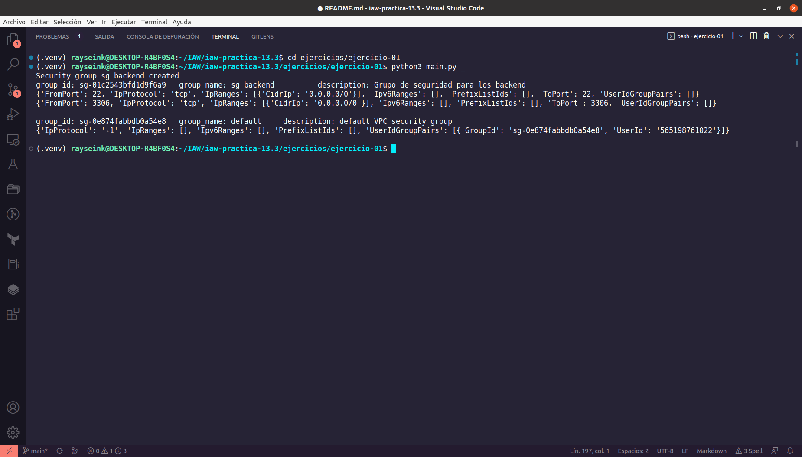

Cuando hayamos hecho la ejecución del archivo, veremos que se ha creado el grupo de seguridad y desde AWS EC2 podemos comprobar que el grupo se ha creado correctamente con los parámetros dados.

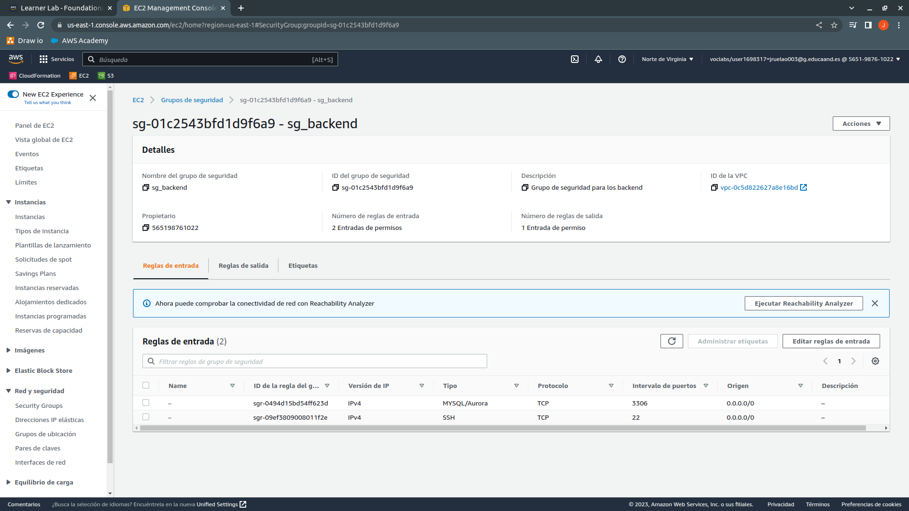

Tras comprobar que se ha creado correctamente, borraremos el grupo de seguridad para el siguiente ejercicio.

## ejercicio-02

Continuaremos con el segundo ejercicio tras la creación correcta del grupo de seguridad. En este ejercicio tenemos que crear de nuevo el grupo de seguridad para instancias backend y crear una instancia a la que le asignaremos el grupo de seguridad que vamos a crear.

### main.py

Reciclaremos el código del ejercicio-01 y agregaremos al final del archivo la función de creación de la instancia, create_instance(). En este caso necesitamos pasar seis parámetros a la función, el ID de la AMI que vamos a usar, en este caso Ubuntu 22.04, la cantidad de instancias que vamos a crear, la cantidad de RAM que tendrá la instancia/s, el archivo de claves para conectarnos mediante SSH, el nombre de la instancia y el nombre del grupo de seguridad que vamos a asignar a la instancia.

```python
import sys

sys.path.append("../..")

from aws_python_boto3.ejemplos.common import aws_resource_functions as aws

from ejercicios.vars import variables

aws.create_security_group(variables.security_group_name_backend, variables.security_group_description_backend, variables.backend_ingress_permissions)

aws.list_security_groups()

aws.create_instance(variables.ubuntu_22_ami_id, variables.total_instances, variables.instance_ram_1gb, variables.ssh_key, variables.instance_name_backend, variables.security_group_name_backend)
```

### Ejecución del archivo

Como hicimos con el ejercicio anterior, ejecutaremos el archivo de este ejercicio y comprobaremos que se crea la instancia y se asigna el grupo de seguridad a la instancia.

Si no hemos borrado el grupo de seguridad, el script se ejecutará, solo que no creará el grupo de seguridad y asignará dicho grupo a la instancia.

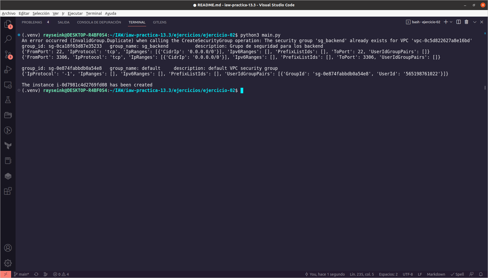

Desde AWS comprobaremos que la instancia se ha creado y que tiene asignado el grupo de seguridad.

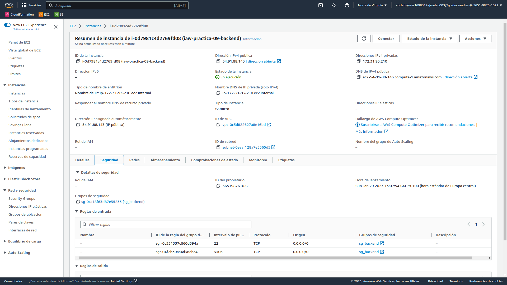

Veremos que tiene el nombre que le hemos asignado a la instancia y el grupo de seguridad con sus respectivas reglas de entrada.

## ejercicio-03

En este ejercicio debemos crear un script para crear una infraestructura de cinco instancias, un balanceador de carga, dos frontend, un backend y un NFS Server con sus respectivos grupos de seguridad y asignar una IP elástica al balanceador de carga.

También debemos tener otro script para eliminar la infraestructura creada, así como la liberación de la IP elástica y los grupos de seguridad.

### create_infra.py

Como hicimos antes, podemos reciclar parte del código ya que deberemos crear cuatro grupos de seguridad, uno para el balanceador, otro para los frontend, otro para el backend y otro para el NFS Server.

Para crear los grupos de seguridad usaremos la función y los siguientes parámetros:

```python
aws.create_security_group(variables.security_group_name_balancer, variables.security_group_description_balancer, variables.balancer_ingress_permissions)

aws.create_security_group(variables.security_group_name_frontend, variables.security_group_description_frontend, variables.frontend_ingress_permissions)

aws.create_security_group(variables.security_group_name_backend, variables.security_group_description_backend, variables.backend_ingress_permissions)

aws.create_security_group(variables.security_group_name_nfs, variables.security_group_description_nfs, variables.nfs_ingress_permissions)
```

Creamos las instancias con los parámetros que necesitamos para las instancias:

```python
aws.create_instance(variables.amazon_linux_ami_id, variables.total_instances, variables.instance_ram_4gb, variables.ssh_key, variables.instance_name_balancer, variables.security_group_name_balancer)

aws.create_instance(variables.amazon_linux_ami_id, variables.total_instances, variables.instance_ram_4gb, variables.ssh_key, variables.instance_name_frontend_01, variables.security_group_name_frontend)

aws.create_instance(variables.amazon_linux_ami_id, variables.total_instances, variables.instance_ram_4gb, variables.ssh_key, variables.instance_name_frontend_02, variables.security_group_name_frontend)

aws.create_instance(variables.amazon_linux_ami_id, variables.total_instances, variables.instance_ram_8gb, variables.ssh_key, variables.instance_name_backend, variables.security_group_name_backend)

aws.create_instance(variables.amazon_linux_ami_id, variables.total_instances, variables.instance_ram_4gb, variables.ssh_key, variables.instance_name_nfs, variables.security_group_name_nfs)
```

Para la asociación de una IP elástica a la cuenta de AWS y su posterior asignación a la instancia que hará de balanceador de carga, **tenemos que esperar a que la instancia esté en estado "running"** ya que en caso contrario **se podrá asociar la IP elástica a la cuenta**, **pero no podremos asignarla a la instancia**. Para ello, hay que usar una función de boto3 que ya está integrada en la función **associate_elastic_ip()** para hacer que se espere hasta que la instancia esté "running".

Con la línea **elastic_ip = aws.allocate_elastic_ip()** obtenemos una IP elástica para la cuenta y **la guardamos en la variable elastic_ip**, después con la línea **balancer_id = aws.get_instance_id(variables.instance_name_balancer)** obtenemos el ID de la instancia a la que vamos a asignar la IP elástica en una variable, en este caso el balanceador de carga, y con la línea **aws.associate_elastic_ip(elastic_ip, balancer_id)** asignamos la IP que hemos obtenido en la variable junto al ID de la instancia y en cuanto la instancia esté en ejecución, asignará la IP elástica a la instancia.

```python
elastic_ip = aws.allocate_elastic_ip()

balancer_id = aws.get_instance_id(variables.instance_name_balancer)

aws.associate_elastic_ip(elastic_ip, balancer_id)
```

#### Ejecución de create_infra.py

Como de costumbre, ejecutaremos el script para comprobar que funciona y que crea tanto los grupos de seguridad como las instancias y que asigna una IP elástica a la instancia que hace de balanceador de carga.

Cuando ejecutemos el script, veremos que se queda esperando a que la instancia a la que se va a asignar la IP elástica esté en estado "running".

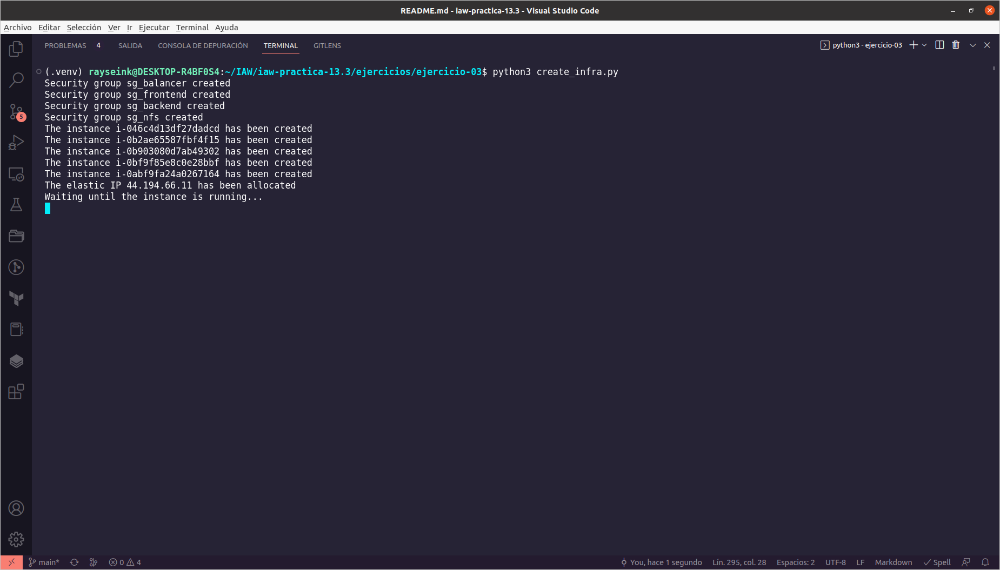

Cuando finaliza, vemos la IP elástica que se ha asociado a la cuenta y asignado a la instancia que hace de balanceador de carga.

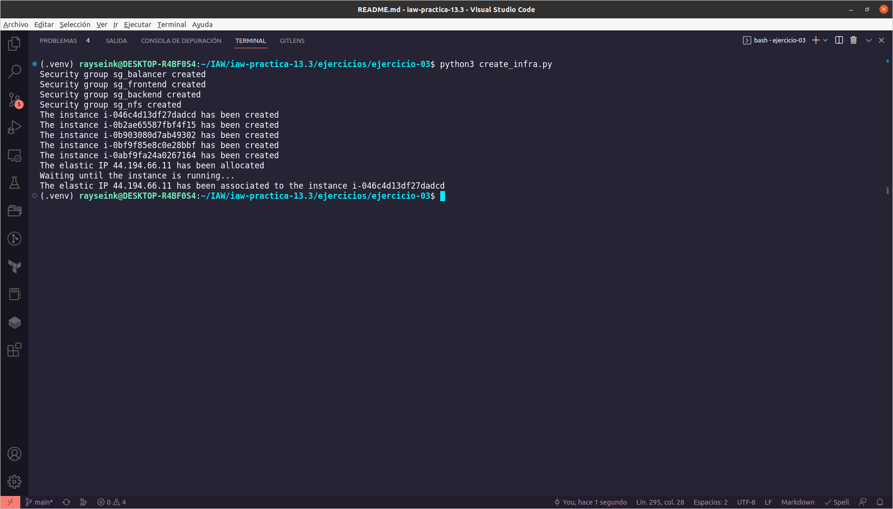

Comprobaremos que se han creado los grupos de seguridad en AWS.

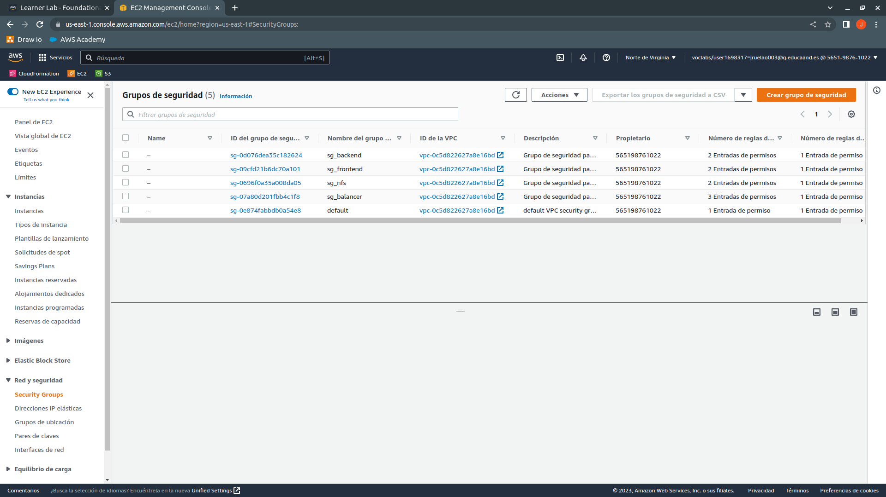

También comprobaremos que se han creado las instancias.

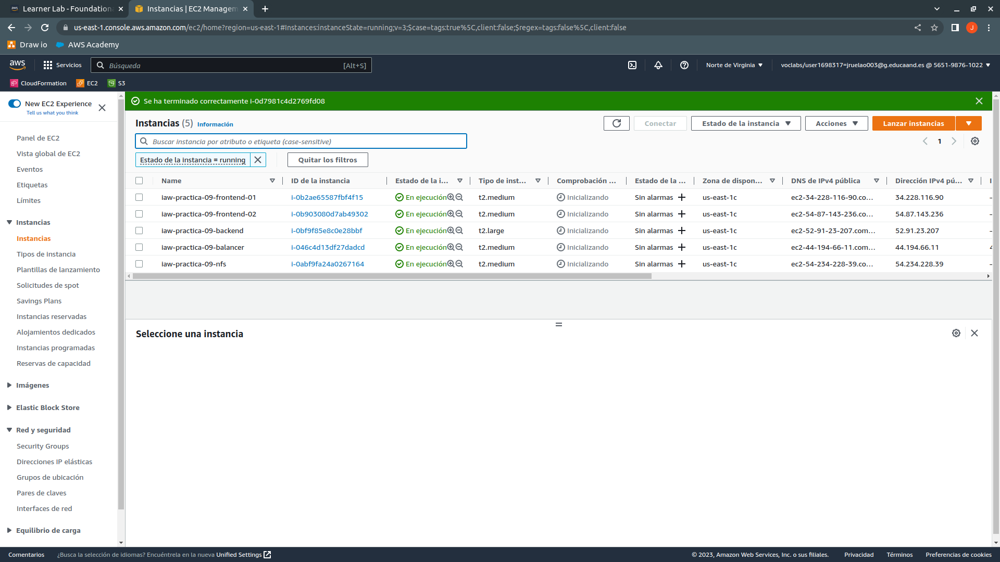

Después, comprobaremos que tenemos una IP elástica asociada a la cuenta.

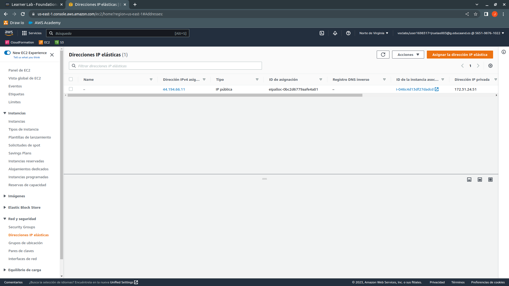

Por último, comprobaremos que la instancia que hace de balanceador de carga tiene la IP elástica.

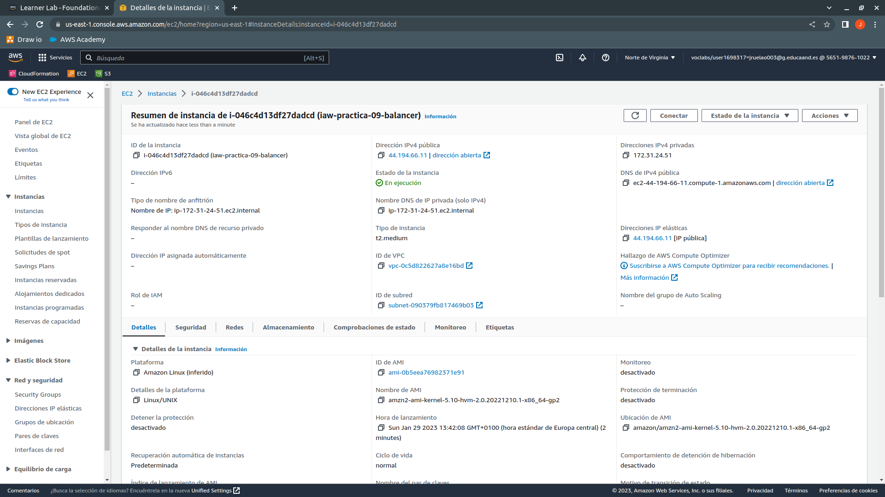

### delete_infra.py

Con este script deberemos borrar la infraestructura creada, primero tenemos que liberar la IP elástica que tiene la instancia que hace de balanceador de carga, después tenemos que borrar las instancias y por último borrar los grupos de seguridad, para borrar los grupos de seguridad tenemos que esperar a que las instancias se queden en estado "terminated" o "terminado" para poder borrar los grupos de seguridad, por lo que hay que crear una función para hacer que se espere a que la instancia esté "terminated" para borrar los grupos de seguridad.

Para realizar este ejercicio **he tenido que usar la función terminate_instance()** para crear dos variantes a partir de la función creada para poder borrar las instancias y posteriormente los grupos de seguridad evitando fallos en la ejecución del script. **Usaremos la parte de importación para este script ya que tanto la creación de grupos de seguridad, de instancias y asociación de IP elástica y su asignación no la necesitamos**.

En la variable **ec2_list_instance_name guardaremos los nombres de las instancias que vamos a eliminar** y en la variable **ec2_list_security_group_name guardaremos los nombres de los grupos de seguridad que hay que borrar**.

```python
ec2_list_instance_name = [variables.instance_name_balancer, variables.instance_name_frontend_01, variables.instance_name_frontend_02, variables.instance_name_backend, variables.instance_name_nfs]

ec2_list_security_group_name = [variables.security_group_name_balancer, variables.security_group_name_frontend, variables.security_group_name_backend, variables.security_group_name_nfs]
```

Posteriormente, necesitamos el ID de la instancia que hace de balanceador de carga para liberar la IP elástica que tiene, **usamos la función get_instance_id(ec2_list_instance_name[0]) y pasamos la lista de instancias, como el balanceador está en la primera posición de la lista, usamos [0] para referirnos al nombre del balanceador y guardamos el resultado en la variable balancer_ip**. Después, con la función **get_instance_public_ip(balancer_id) obtendremos la IP elástica que tiene y la guardaremos en la variable balancer_ip**. Por último, usamos la función **release_elastic_ip(balancer_ip) para liberar la IP elástica de la instancia**.

```python
balancer_id = aws.get_instance_id(ec2_list_instance_name[0])

balancer_ip = aws.get_instance_public_ip(balancer_id)

aws.release_elastic_ip(balancer_ip)
```

A continuación procederemos con el borrado de las instancias, como hemos guardado las instancias en una lista, sólo tenemos que usar un bucle FOR para recorrer la lista y dentro del bucle llamamos a la función para eliminar la instancia que se encuentra en el bucle y esperar a que se eliminen completamente.

```python
for ec2_name in ec2_list_instance_name:
    print(f'Terminating the instance {ec2_name}...')

    aws.terminate_instance_waiting(ec2_name)
```

Por último, hacemos lo mismo con los grupos de seguridad, usamos un bucle FOR para recorrer la lista de los grupos de seguridad y dentro del bucle llamamos a la función que borra el grupo de seguridad que está en ese momento en el bucle.

```python
for sg_name in ec2_list_security_group_name:
    print(f'Terminating the security group {sg_name}...')

    aws.delete_security_group(sg_name)
```

#### Ejecución de delete_infra.py

Ejecutaremos el script y comprobaremos que se libera la IP elástica, se eliminan las instancias y después se borran los grupos de seguridad.

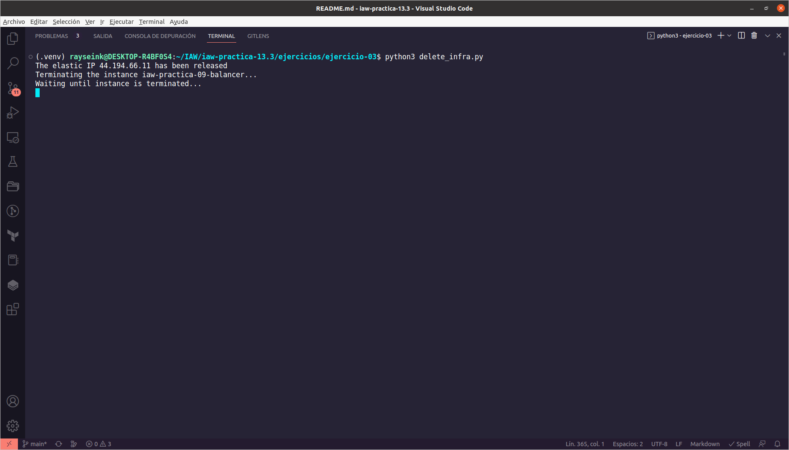

Cuando termine de ejecutarse el script, deberá salir algo similar, sin fallos.

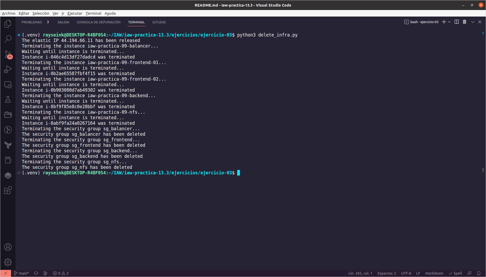

Comprobaremos desde AWS que las instancias se han eliminado.

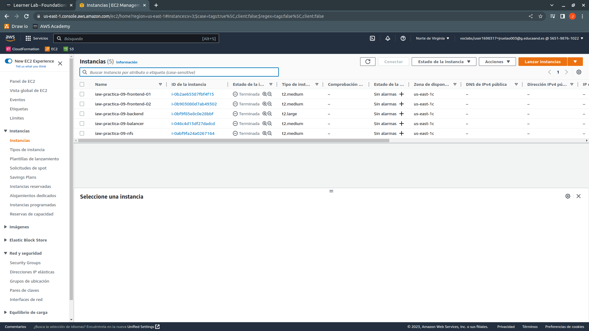

También comprobaremos que se ha liberado la IP elástica que teníamos asignada.

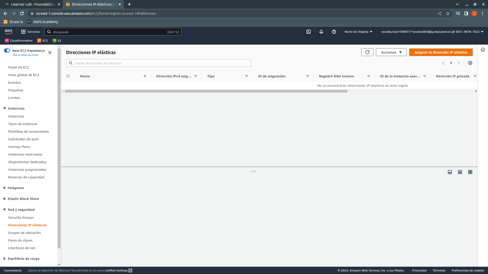

Por último, comprobaremos que se han borrado los grupos de seguridad.

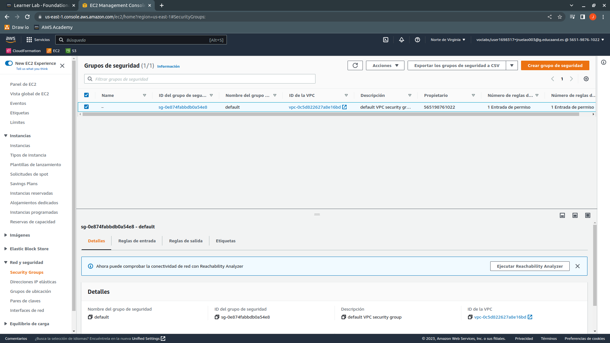

## ejercicio-04

Partiremos de un archivo ya creado para agregar más funcionalidades al mismo --> [Script base](https://github.com/juanramonrueda/iaw-practica-13.3/blob/main/aws_python_boto3/ejemplos/ejemplo-07.py)

Puesto que la mayor parte del script está explicado en el archivo, pasaré a explicar las partes que he añadido.

He creado un directorio, modules, al que he añadido dos archivos más, uno que sirve para limpiar la pantalla (clear_screen.py) y otro que contiene varios menús con opciones para el usuario (menu_options.py).

Importaremos el módulo "time" para hacer paradas en el código y permitir al usuario leer mensajes y los dos archivos o módulos hay que importarlos de la misma manera que los demás, salvo que estos están un nivel abajo del archivo principal, por lo que únicamente tenemos que hacer referencia al directorio en el que se encuentran y acto seguido importar el archivo.

```python
import time

from modules import clear_screen

from modules import menu_options
```

Después inicializaremos dos variables, la primera sirve para entrar al bucle WHILE que hay en la función "main" y la segunda variable nos permite acceder a un IF que hay al principio del bucle.

```python
user_option = str(1)

counter = 0
```

Como nos interesa que en la función "entren" las dos variables, tenemos que indicar a la función que necesitará ambos parámetros para funcionar correctamente. Después, dentro de la función, tenemos el bucle WHILE con la condición de que mientras "user_option" sea distinto a 14 (como cadena y no como entero) no se finalice el bucle. A continuación, dentro del bucle tenemos un IF con la condición de que mientras la variable "counter" sea mayor o igual a 1 (entero) entre en el IF y haga una parada de tres segundos y una petición de pulsación de tecla para continuar.

```python
def main(user_option, counter):
    while user_option != '14':
        if counter >= 1:
            time.sleep(3)
            input('\nPress the Enter key to continue... ')
```

A continuación, llamaremos al módulo que limpia la pantalla y su función para evitar que en el terminal haya más información que la que interesa y después mostramos el menú principal con las opciones disponibles al usuario. Después del menú de opciones, pedimos una opción al usuario, el tipo de la variable la cambio de INT (entero) a STR (cadena) para que si el usuario introduce cualquier letra, número, símbolo... el código la transforme siempre a STR y evitar fallos en la ejecución del código.

```python
        clear_screen.main()
        menu_options.main_menu()
        user_option = str(input('\nSelect a menu option (1 - 14): '))
```

En el caso de que el usuario quiera la primera opción, le mostrará los grupos de seguridad que hay creados, para ello, usamos IF y ponemos el número entre comillas simples o dobles para tratarlo como una cadena y no como un entero. Dentro del IF, llamamos al archivo que contiene las funciones y hacemos que se ejecute la función para listar los grupos de seguridad.

```python
        if user_option == '1':
            aws.list_security_groups()
```

En el caso de que el usuario quiera la segunda opción, crear un grupo de seguridad, le mostraremos los grupos de seguridad que hay disponibles en el archivo que contiene los distintos menús y llamamos al de grupos de seguridad. Después pedimos al usuario que introduzca una opción y la comparamos, en el caso de que no esté dicha opción (else), le mostramos que no existe dicha opción, hacemos una parada de tres segundos y usamos continue para volver al menú principal. En el caso de que haya escogido una opción correcta, después le pedimos el nombre para el grupo de seguridad y su descripción, además de usar la función para la creación del grupo de seguridad.

```python
        elif user_option == '2':
            menu_options.security_groups()
            sg_choice = str(input('\nSelect the security group (1 - 4): '))
            if sg_choice == '1':
                sg_ingress_permissions = variables.balancer_ingress_permissions
            elif sg_choice == '2':
                sg_ingress_permissions = variables.frontend_ingress_permissions
            elif sg_choice == '3':
                sg_ingress_permissions = variables.backend_ingress_permissions
            elif sg_choice == '4':
                sg_ingress_permissions = variables.nfs_ingress_permissions
            else:
                print('Wrong option, returning to main menu...')
                time.sleep(3)
                continue
            sg_name = input('Enter the name for the security group: ')
            sg_description = input('Enter the description for the security group: ')
            aws.create_security_group(sg_name, sg_description, sg_ingress_permissions)
```

En el caso de que quiera borrar un grupo de seguridad, la tercera opción, le pediremos que introduzca el nombre del grupo de seguridad que quiere borrar y llamamos a la función para borrar dicho grupo de seguridad. En el caso de que no exista el grupo de seguridad, la función devolverá un False y mostraremos al usuario un mensaje de que el grupo no existe, haremos una parada de tres segundos y usaremos continue para volver al menú principal.

```python
        elif user_option == '3':
            sg_name = input('Enter the name of the security group to be deleted: ')
            aws.delete_security_group(sg_name)
            if aws.security_group_exists(sg_name) == False:
                print('\nThe security group does not exist')
                time.sleep(3)
                continue
```

Con la creación de una instancia, la cuarta opción, inicializaremos dentro del IF la variable count a 0 para controlar la cantidad de veces que el usuario se puede equivocar al seleccionar la cantidad de instancias que puede crear. Dentro del IF, mostramos el menú con las opciones de sistemas operativos disponibles y pedimos que seleccione la AMI que quiere para la instancia y comparamos la petición con las opciones disponibles, en caso de no estar, mostrará un mensaje de error y volverá al menú principal, después se pedirá que introduzca la cantidad de instancias que quiere crear y como sólo se pueden crear de 1 a 9 instancias, controlaremos que el contenido de la variable esté entre 1 y 9. Después, mostrará un menú con las distintas capacidades de memoria principal que tienen las instancias y se pedirá una, a continuación pediremos el nombre del archivo de claves para la conexión por SSH, el nombre de la instancia y el grupo de seguridad que tendrá y que en caso de no existir, no creará la instancia, por último, si todas las variables son correctas, creará la instancia/s.

```python
        elif user_option == '4':
            count = 0
            menu_options.amis()
            ami_option = int(input('\nSelect the AMI to assign to the instance (1 - 3): '))
            if ami_option == 1:
                ami_code = variables.ubuntu_22_ami_id
            elif ami_option == 2:
                ami_code = variables.rhel_9_ami_id
            elif ami_option == 3:
                ami_code = variables.amazon_linux_ami_id
            else:
                print('Wrong option, returning to main menu...')
                time.sleep(3)
                continue
            total_instances = int(input('Enter the total instances to create (min 1 -- max 9): '))
            while total_instances < 1 or total_instances > 9:
                total_instances = int(input('Enter the total instances to create (min 1 -- max 9): '))
                count = count + 1
                if count >= 5:
                    print('Jerk!!')
                    time.sleep(3)
                    continue
            menu_options.instance_ram()
            ram_type = int(input('\nSelect the total RAM to assign to the instance: '))
            if ram_type == 1:
                ram_instance = variables.instance_ram_1gb
            elif ram_type == 2:
                ram_instance = variables.instance_ram_2b
            elif ram_type == 3:
                ram_instance = variables.instance_ram_4gb
            elif ram_type == 4:
                ram_instance = variables.instance_ram_8gb
            else:
                print('Wrong option, returning to main menu...')
                time.sleep(3)
                continue
            key_file = input('Enter the name of private key to use against the SSH server: ')
            instance_name = input('Enter the instance name: ')
            sg_name = input('Select the security group to assign: ')
            if aws.security_group_exists(sg_name) == False:
                print('\nThe security group does not exist')
                time.sleep(3)
                continue
            aws.create_instance(ami_code, total_instances, ram_instance, key_file, instance_name, sg_name)
```

Puesto que las siguientes opciones no cambian apenas con respecto al archivo original, explicaré el final de la función y su ejecución.

Con la variable counter = counter + 1 al final del bucle actualizamos la variable que al principio estaba a 0 para entrar en el primer IF y hacer la parada de tres segundos y realizar la petición de tecla para continuar.

```python
        counter = counter + 1
```

Por último, llamaremos a la función "main" y tendremos que pasar ambas variables para que entren en la función en el mismo orden en el que las hemos establecido al principio de la función.

```python
if __name__ == "__main__":
    main(user_option, counter)
```